# 🏦 Müştəri Churn Analizi — Bank Customer Churn Analysis

<div align="center">


**Bank müştərilərinin şirkəti niyə tərk etdiyini müəyyən edən tam Data Analytics layihəsi**

</div>

---

## 📌 Layihə Haqqında

Bu layihə bank sektorunda **müştəri churn-unun** (müştəri axınının) dərindən analiz edilməsinə həsr olunmuşdur. 10,000 müştəri məlumatı əsasında churn-u şərtləndirən amillər müəyyən edilmiş, müştərilər risk qruplarına bölünmüş və konkret biznes tövsiyələri hazırlanmışdır.

> *"Mövcud müştərini saxlamaq, yeni müştəri əldə etməkdən 5–7 dəfə ucuzdur."*  
> — Frederick Reichheld, Bain & Company

---

## 🎯 Biznes Problemi

Bank müştəri itkisindən əziyyət çəkir. Məsələ yalnız statistika deyil — hər itirdilən müştəri **birbaşa gəlir itkisi**, **reputasiya zərəri** və **yeni müştəri cəlb xərci** deməkdir.

**Bu layihədə 3 əsas suala cavab axtarılır:**

1. 🔴 **Kim çıxır?** — Hansı müştəri profilləri ən yüksək churn riski daşıyır?
2. 🟡 **Niyə çıxır?** — Churn-un əsas sürücüləri hansılardır?
3. 🟢 **Nə etməli?** — Riski azaltmaq üçün hansı konkret addımlar atılmalıdır?

---

## 📊 Dataset Haqqında

| Xüsusiyyət | Dəyər |
|-----------|-------|
| **Mənbə** | Bank Churn Classification Dataset |
| **Sətir sayı** | 10,000 müştəri |
| **Sütun sayı** | 9 xüsusiyyət |
| **Hədəf dəyişən** | `Churn` (0 = Qalmışdır, 1 = Tərk etmişdir) |
| **Churn faizi** | 26.7% |

**Sütunlar:**

| Sütun | Tip | Təsvir |
|-------|-----|--------|
| `CustomerID` | int | Unikal müştəri ID |
| `Gender` | str | Cins (Male / Female) |
| `SeniorCitizen` | int | Yaşlı vətəndaş (0/1) |
| `Tenure` | int | Müştərilik müddəti (ay) |
| `MonthlyCharges` | float | Aylıq ödəniş ($) |
| `TotalCharges` | float | Ümumi ödəniş ($) |
| `Contract` | str | Müqavilə növü |
| `PaymentMethod` | str | Ödəniş metodu |
| `Churn` | int | Churn statusu (hədəf) |

---

## 🛠️ İstifadə Olunan Texnologiyalar

```
Python 3.10+
├── pandas          — Data manipulyasiya
├── numpy           — Rəqəmsal hesablamalar  
├── matplotlib      — Statik vizualizasiya
├── seaborn         — Statistik vizualizasiya
└── plotly          — İnteraktiv qrafiklər
```

---

## 📁 Layihə Strukturu

```
customer-churn-analysis/
│
├── 📓 customer_churn_analysis.ipynb    # Əsas Jupyter Notebook
├── 📄 README.md                         # Bu fayl
├── 📊 data.csv                          # Dataset
│
└── 🖼️ images/
    ├── churn_distribution.png
    ├── gender_churn.png
    ├── senior_citizen_churn.png
    ├── contract_churn.png
    ├── payment_method_churn.png
    ├── tenure_vs_churn.png
    ├── monthly_charges_vs_churn.png
    ├── total_charges_vs_churn.png
    ├── correlation_heatmap.png
    ├── customer_segments.png
    └── risk_analysis.png
```

---

## 🔬 Analiz Mərhələləri

### 1️⃣ Layihəyə Giriş
- Customer Churn anlayışının izahı
- Biznes əhəmiyyəti və təsir analizi
- Layihənin məqsədi və sualları

### 2️⃣ Datasetin Tanınması
- Dataset ölçüsü və strukturu
- Sütun tipləri və unikal dəyərlər
- Statistik icmal

### 3️⃣ Data Quality Check
- Missing value analizi
- Dublikat qeydlərin aşkarlanması
- Outlier analizi (IQR metodu)
- Data type yoxlanışı

### 4️⃣ Data Cleaning
- Lazımsız sütunların çıxarılması
- Label encoding əlavələri
- Dataset hazırlanması

### 5️⃣ Exploratory Data Analysis (EDA)
10 əsas biznes sualına cavab:
- Ümumi churn paylanması
- Gender üzrə analiz
- SeniorCitizen analizi
- Müqavilə növü təsiri
- Ödəniş metodu analizi
- Tenure–churn əlaqəsi
- MonthlyCharges analizi
- TotalCharges analizi
- Korrelyasiya matrisi

### 6️⃣ Feature Engineering
Yeni xüsusiyyətlərin yaradılması:
- `Tenure_Group` — Müştərilik müddəti qrupu
- `Charges_Category` — Ödəniş kateqoriyası
- `Customer_Segment` — Müştəri seqmenti
- `Risk_Level` — Risk səviyyəsi

### 7️⃣ Risk Analizi
- Məntiqi qaydalar əsasında risk hesablaması
- Risk qrupları paylanması
- Hər qrupda churn faizi
- Biznes tövsiyələri

### 8️⃣ Yekun Hesabat
- 15 əsas biznes insight
- C-level summary dashboard
- Strategik tövsiyələr

---

## 🏆 Əsas Nəticələr

| # | İnsight | Dəyər |
|---|---------|-------|
| 1 | Ümumi churn faizi | **26.7%** |
| 2 | Month-to-month churn | **~42%** |
| 3 | 2 illik müqavilə churn | **~7%** |
| 4 | Yeni müştəri (0-12 ay) churn | **Ən yüksək** |
| 5 | Sadiq müştəri (49+ ay) churn | **Ən aşağı** |
| 6 | Gender fərqi | **Yoxdur** |
| 7 | Ödəniş metodu fərqi | **Minimal** |
| 8 | MonthlyCharges & Churn | **Müsbət korrelyasiya** |

---

## 🖼️ Vizuallaşdırmalar

### Ümumi Churn Paylanması
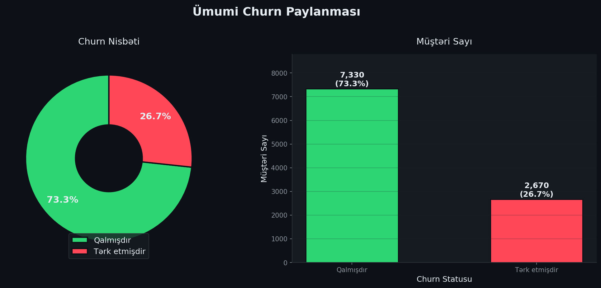

### Gender üzrə Churn
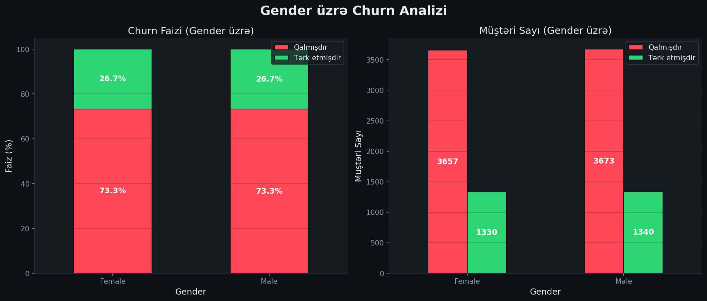

### SeniorCitizen üzrə Churn
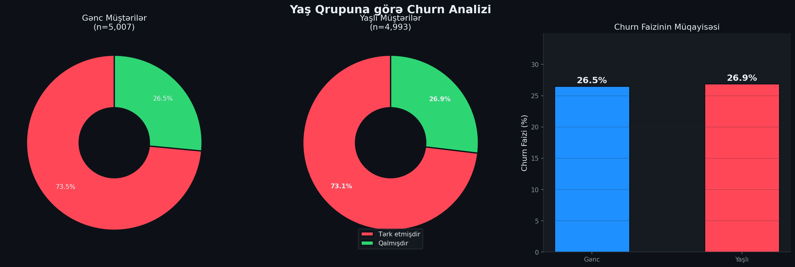

### Müqavilə Növü üzrə Churn
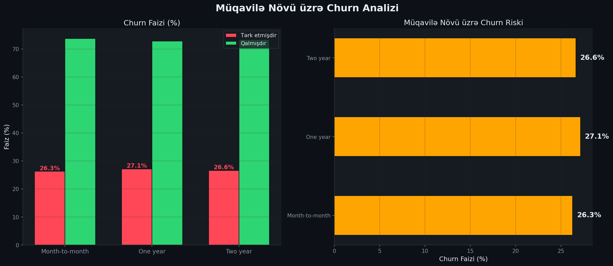

### Ödəniş Metodu üzrə Churn
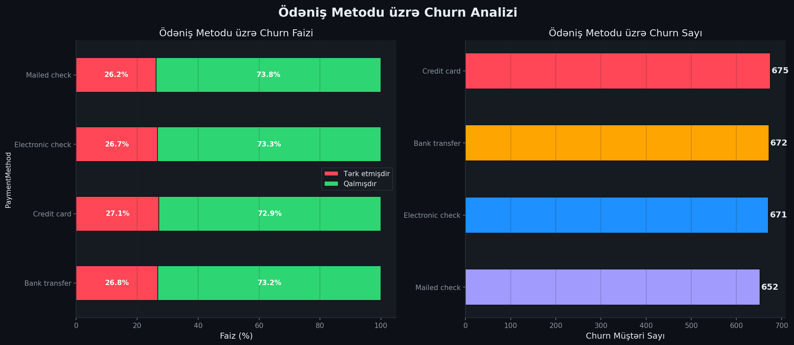

### Tenure vs Churn
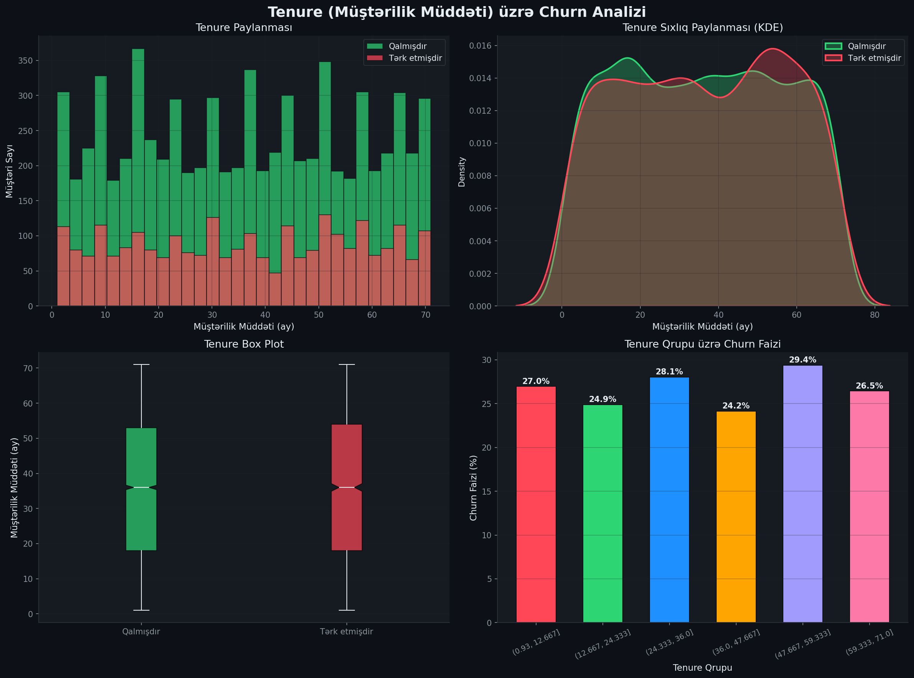

### Aylıq Ödəniş vs Churn
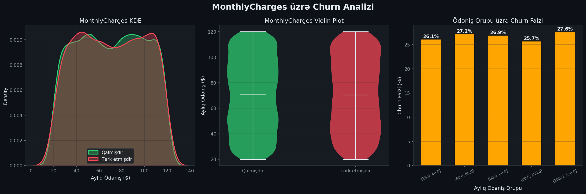

### Ümumi Ödəniş vs Churn
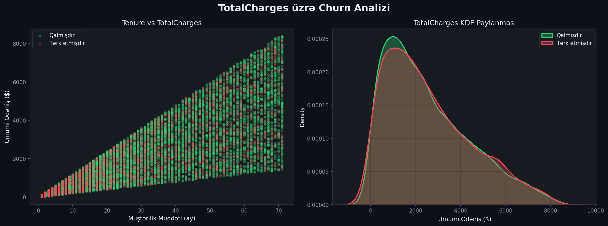

### Korrelyasiya Matrisi
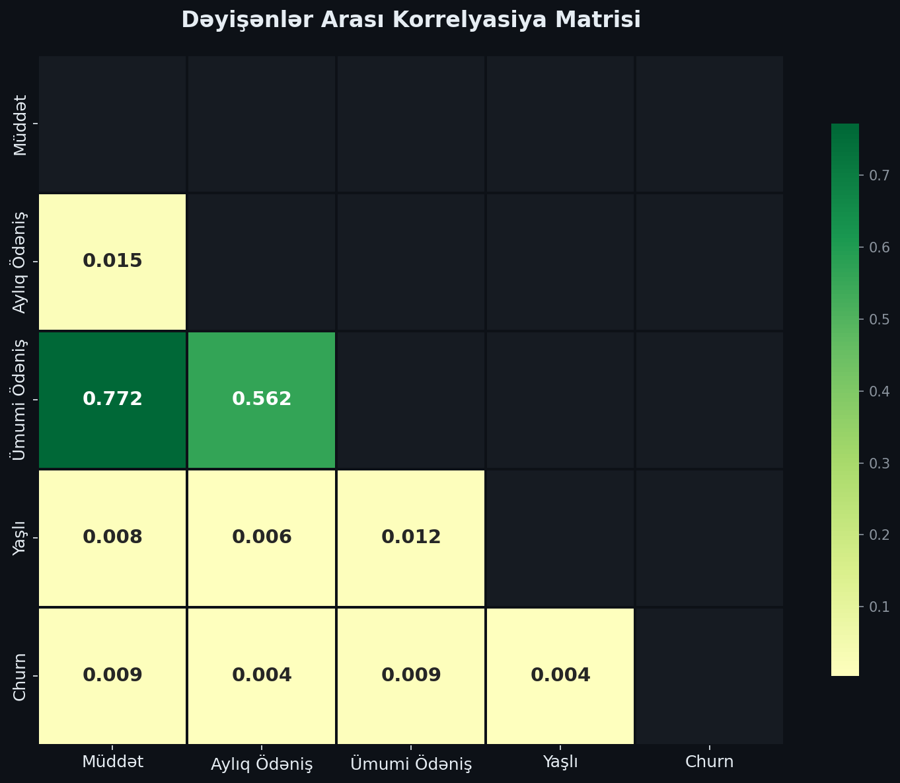

### Müştəri Seqmentləri
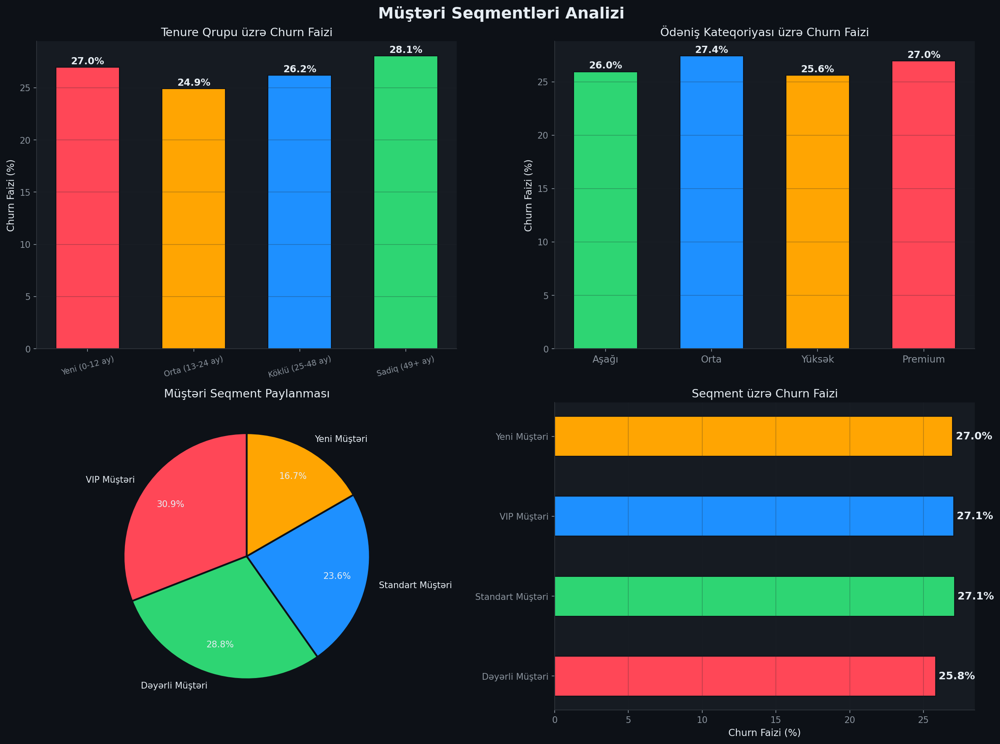

### Risk Analizi
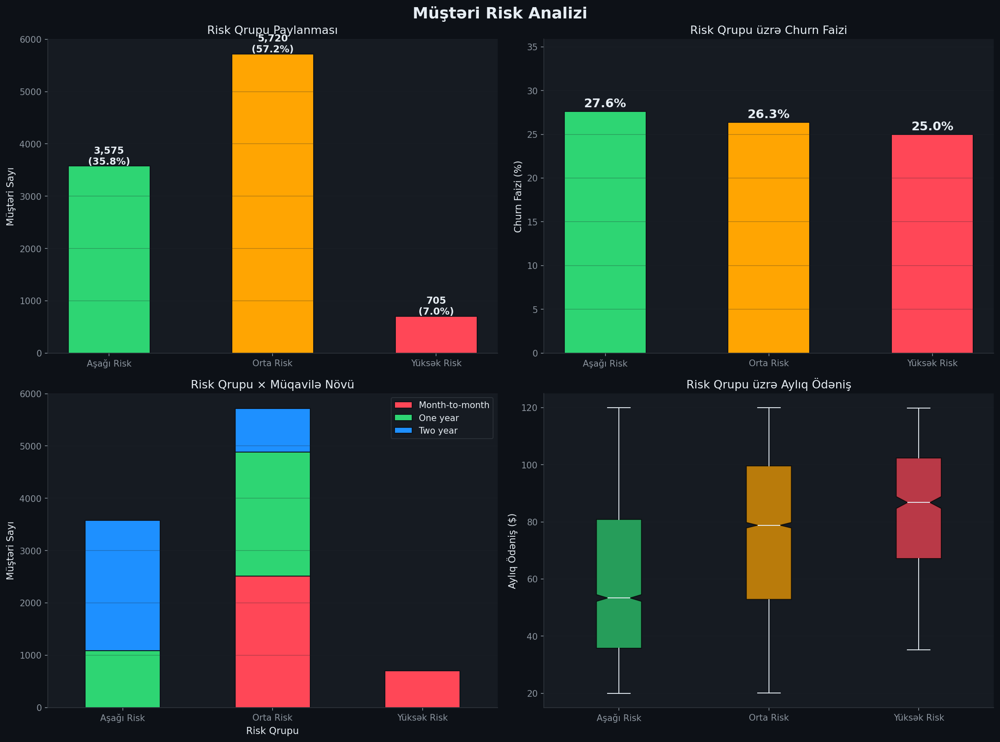

---

## 💡 Biznes İnsightları

### 🔴 Kritik Tapıntılar

1. **Month-to-month müqavilə** — Ən güclü churn proqnozlayıcısı. Bu müştərilər 2 illik müqaviləli müştərilərdən ~6x daha çox çıxır.

2. **İlk 12 ay kritik** — Yeni müştərilərin churn riski ən yüksəkdir. Onboarding prosesi gücləndirilməlidir.

3. **Qiymət həssaslığı** — MonthlyCharges artdıqca churn artır. Premium müştərilər xüsusi diqqət tələb edir.

### 🟡 Strategik Fürsətlər

4. **Müqavilə konversiyası** — Month-to-month müştəriləri uzunmüddətli müqaviləyə keçirmək ən güclü retention leverkidir.

5. **Tenure milestone-ları** — 24 ay = sadiqlik nöqtəsi. Müştəriləri bu həddə çatdırmaq uzunmüddətli saxlamanı zəmanətləyir.

6. **Risk modelinin tətbiqi** — Məntiqi risk modeli yüksək riskli müştəriləri müəyyən edir. Proaktiv müdaxilə mümkündür.

### 🟢 Tövsiyələr

7. **Loyallıq proqramı** — Month-to-month müştərilər üçün uzunmüddətli müqavilə endirimləri.

8. **VIP xidmət** — Yüksək TotalCharges olan müştərilər üçün fərdiləşdirilmiş xidmət.

9. **Onboarding optimizasiyası** — İlk 12 ayda müştəri ilə aktiv əlaqə saxlanmalıdır.

---

## 🚀 Layihəni İşə Salmaq

### Tələblər

```bash
Python 3.10+
pip install pandas numpy matplotlib seaborn plotly jupyter
```

### Addımlar

```bash
# 1. Reponu klonla
git clone https://github.com/USERNAME/customer-churn-analysis.git
cd customer-churn-analysis

# 2. Asılılıqları yüklə
pip install -r requirements.txt

# 3. Jupyter Notebook aç
jupyter notebook customer_churn_analysis.ipynb
```

### `requirements.txt`
```
pandas>=2.0.0
numpy>=1.24.0
matplotlib>=3.7.0
seaborn>=0.12.0
plotly>=5.15.0
jupyter>=1.0.0
nbformat>=5.9.0
```

---

## 🔮 Gələcək İnkişaf Planları

- [ ] **Machine Learning Modeli** — Random Forest / XGBoost ilə churn proqnozu
- [ ] **Streamlit Dashboard** — İnteraktiv real-vaxt analitika paneli
- [ ] **Customer LTV Hesablaması** — Life Time Value analizi
- [ ] **A/B Test Simulyasiyası** — Retention kampaniyalarının effektivlik testi
- [ ] **SQL İnteqrasiyası** — PostgreSQL ilə production-ready pipeline
- [ ] **API Endpoint** — FastAPI ilə churn risk API-si
- [ ] **Avtomatik Hesabat** — Scheduledreport generation

---

## 👤 Müəllif

**Data Analytics Portfolio Layihəsi**

Bu layihə GitHub portfolio üçün hazırlanmış professional Data Analytics nümunəsidir.

[](https://github.com/USERNAME)
[](https://linkedin.com/in/USERNAME)

---

<div align="center">

**⭐ Bu layihəni faydalı tapdınızsa, star verməyi unutmayın!**

*Python · Pandas · Matplotlib · Seaborn · Plotly · Data Analytics · Business Intelligence*

</div>
